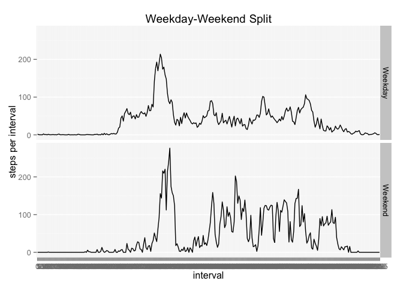

# PA1_template.Rmd

To answer the questions listed, we first source a couple of libraries and read in the .csv file as below:

```r
library(ggplot2)
```

```
## Warning: package 'ggplot2' was built under R version 3.1.3
```

```r
library(plyr)
# Read the csv file
rawdata<-read.csv("activity.csv")
```
We then proceed to compute the mean and median steps per day. We remove any unknown (NA) values, however we do so only after splitting the dataset into the total steps taken per day. This analysis reveals a mean of about 10766 steps per day and a median of 10765 steps. The code to compute this is listed below:

```r
# Calculate the mean and median steps per day
rawdata$date<-as.factor(rawdata$date)
stepsPerDay<-tapply(rawdata$steps,rawdata$date,sum)
meanStepsPerDay<-mean(stepsPerDay,na.rm=TRUE)
medianStepsPerDay<-median(stepsPerDay,na.rm=TRUE)
print(paste("Mean steps per day: ", meanStepsPerDay))
```

```
## [1] "Mean steps per day:  10766.1886792453"
```

```r
print(paste("Median steps per day: ", medianStepsPerDay))
```

```
## [1] "Median steps per day:  10765"
```

```r
hist(stepsPerDay,xlab="steps",main="Steps per Day")
```

 
We next assess the activity pattern during the day. Doing so reveals that the maximum activity (most number of steps) occurs at interval 835:

```r
# Plot the activity pattern
rawdata$interval <- as.factor(rawdata$interval)
stepsPerInterval <- tapply(rawdata$steps,rawdata$interval,mean,na.rm=TRUE)
plot(names(stepsPerInterval),stepsPerInterval,type="l",
     xlab="Interval",ylab="steps per interval",main="Steps per Interval")
```

 

```r
print(paste("Max steps occur in interval ", 
            names(which(stepsPerInterval == max(stepsPerInterval)))))
```

```
## [1] "Max steps occur in interval  835"
```
Since there are many missing values in the data, we have imputed these by using the average from the available data for that interval. Doing so reveals that our original analysis is pretty much spot-on, with the means and medians remaining roughly the same.

```r
# Impute and report missing data
print(paste("Number of rows with missing data is",
            nrow(rawdata[!complete.cases(rawdata),])))
```

```
## [1] "Number of rows with missing data is 2304"
```

```r
newdata <- rawdata
for (i in 1:nrow(newdata)) {
  if (is.na(rawdata[i,1])) {
    newdata[i,1]<-stepsPerInterval[newdata[i,3]]
  }
}
# Calculate mean and median for the new data
print(paste("New mean steps per day are ",
            mean(tapply(newdata$steps,newdata$date,sum))))
```

```
## [1] "New mean steps per day are  10766.1886792453"
```

```r
print(paste("New median steps per day are ",
            median(tapply(newdata$steps,newdata$date,sum))))
```

```
## [1] "New median steps per day are  10766.1886792453"
```

```r
hist(tapply(newdata$steps,newdata$date,sum), 
     xlab="steps", main="Imputed Steps per Day")
```

 
Next we analyze for differences between weekdays and weekends. The average activity plots reveal that there is more activity throughout the day during the weekends, while activity during weekdays is restricted to only a few sections of the day.

```r
#Compute and add weekdays and weekends
rawdata$weekday <- ifelse(
  (weekdays(as.Date(rawdata$date)) == "Saturday" | 
     weekdays(as.Date(rawdata$date)) == "Saturday"),
  "Weekend","Weekday")
byWeekday<-ddply(rawdata,"weekday",function(x) {
  ddply(x,"interval",function(y) {
    mean(y$steps,na.rm=TRUE)
  })
})
g<-ggplot(byWeekday,aes(interval,V1))
print(g+geom_line(aes(group=weekday))+facet_grid(weekday~.)+ggtitle("Weekday-Weekend Split") +ylab("steps per interval"))
```

 
